# RetailSales SQL Database Project 

## Project Overview
The goal of this project is to analyze retail sales data using SQL Server. The dataset contains 2,000 rows with details of transactions such as date, time, customer_id, age, gender, product category, quantity, price, cost, and total sales. The objective is to clean the dataset, define the schema properly, and run queries to answer key business questions. 

## Table of Content 
- [Project Overview](#project-overview)
- [Objectives](#objectives)
- [Tools and Methodologies](#tools-and-methodologies)
- [Key Analytical Questions](#key-analytical-questions)
- [Samples of SQL Queries and Results](#samples-of-sql-queries-and-results)
- [Answers to Analytical Questions and Results](#answers-to-analytical-questions-and-results)
- [References](#references)

## Objectives 
The primary goal of this project is to 
- Create a sample relational database
- Import dataset into the database
- Identify and remove any records with missing or null values
- Perform basic exploratory data analysis to understand the dataset
- Use SQL to answer specific business questions and derive insights from the sales data

## Tools and Methodologies 
**Tool Used:** **SQL SERVER MANAGEMENT STUDIO 21** [Download Here](https://www.microsoft.com/en-us/sql-server/sql-server-downloads) 

1. Open your SSMS.
2. Load and execute script like:
  - Create a new database called **RetailSales**
  - Import **Retail_Sales_Analysis** dataset into **RetailSales** database
  - Changed data types to the appropriate data type and set **translation_id** as primary key
  - Correct column name 'quantiy' to 'quantity'
  - Replace missing age with average age
  - Delete cell with missing values
  - Anwser analytical questions and run queries

## Key Analytical Questions 
The queries in this project aim to answer the following key questions based on the RetailSales dataset: 
1. Rretrieve all columns for sales made on '2022-11-05.
2. Retrieve all transactions where the category is 'Clothing' and the quantity sold is more than 4 in the month of Nov-2022.
3. Calculate the total sales (total_sale) for each category.
4. Find the average age of customers who purchased items from the 'Beauty' category.
5. Find all transactions where the total_sale is greater than 1000.
6. Find the total number of transactions (transaction_id) made by each gender in each category.
7. Calculate the average sale for each month. Find out best-selling month in each year.
8. Find the top 5 customers based on the highest total sales.
9. Find the number of unique customers who purchased items from each category.
10. Create each shift and number of orders.

## Samples of SQL Queries and Results 
Here are examples of key queries used in the project and their results: 

1. **CREATING DATABASE**
<pre> 
CREATE DATABASE [RetailSales]; --SQL Server 
</pre> 

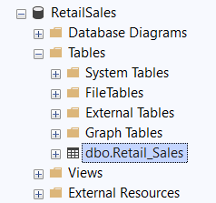 

2. **Replacing missing age with average age**
<pre> 
UPDATE retail_sales 
SET age = (SELECT ROUND(AVG(age), 0) FROM retail_sales WHERE age IS NOT NULL) 
WHERE age IS NULL; 
</pre> 

3. **Delete cell with missing values**
<pre>
DELETE FROM retail_sales 
WHERE quantiy IS NULL 
  OR price_per_unit IS NULL 
  OR total_sale IS NULL; 
</pre> 

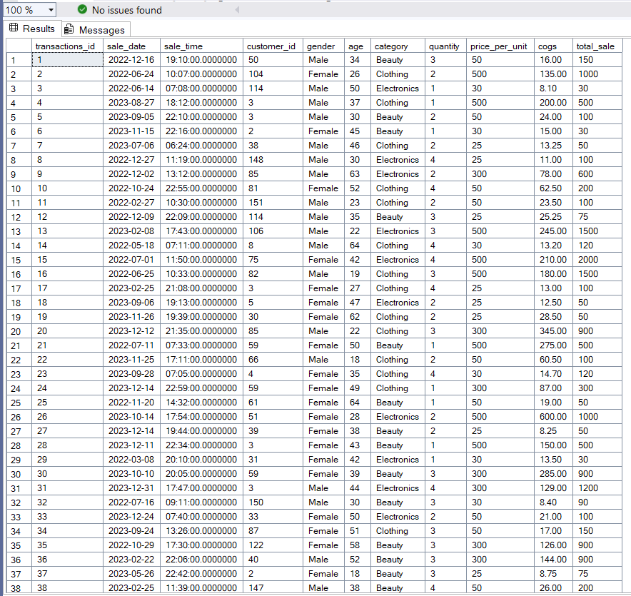 

## Answers to Analytical Questions and Results

1. **Rretrieve all columns for sales made on '2022-11-05**
<pre>
--Rretrieve all columns for sales made on '2022-11-05 
SELECT *
FROM retail_sales
WHERE sale_date = '2022-11-05';
</pre> 

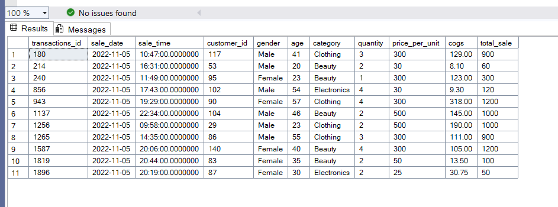

2. **Retrieve all transactions where the category is 'Clothing' and the quantity sold is more than 4 in the month of Nov-2022**
<pre> 
--Retrieve all transactions where the category is 'Clothing' and the quantity sold is more than 4 in the month of Nov-2022 
SELECT *
FROM retail_sales
WHERE category = 'Clothing'
  AND quantity > 4
  AND sale_date BETWEEN '2022-11-01' AND '2022-11-30';
</pre> 

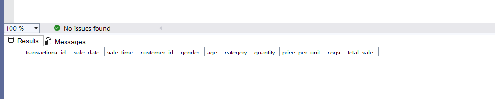

3. **Calculate the total sales (total_sale) for each category**
<pre> 
--Calculate the total sales (total_sale) for each category 
SELECT category, 
       SUM(total_sale) AS total_sales
FROM retail_sales
GROUP BY category;
</pre>

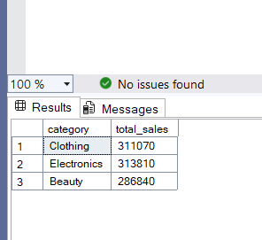

4. **Find the average age of customers who purchased items from the 'Beauty' category**
<pre> 
--Find the average age of customers who purchased items from the 'Beauty' category 
SELECT ROUND(AVG(age), 0) AS avg_age
FROM retail_sales
WHERE category = 'Beauty';
</pre> 

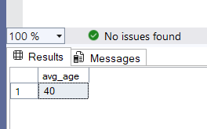

5. **Find all transactions where the total_sale is greater than 1000**
<pre>
--Find all transactions where the total_sale is greater than 1000 
SELECT *
FROM retail_sales
WHERE total_sale > 1000;
</pre> 

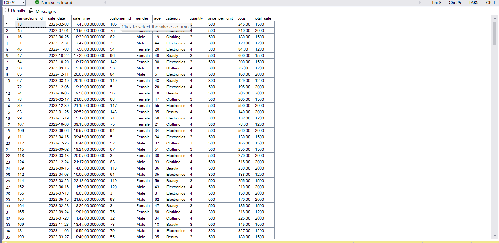

6. **Find the total number of transactions (transaction_id) made by each gender in each category**
<pre> 
--Find the total number of transactions (transaction_id) made by each gender in each category 
SELECT gender, 
       category, 
       COUNT(transactions_id) AS total_transactions
FROM retail_sales
GROUP BY gender, category;
</pre> 

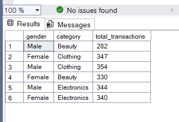

7. **Calculate the average sale for each month. Find out best-selling month in each year**
<pre> 
-- Average sale per month
SELECT 
    YEAR(sale_date) AS sales_year,
    MONTH(sale_date) AS sales_month,
    ROUND(AVG(total_sale), 2) AS avg_monthly_sale
FROM retail_sales
GROUP BY YEAR(sale_date), MONTH(sale_date);

-- Best-selling month in each year
SELECT sales_year, sales_month, avg_monthly_sale
FROM (
    SELECT 
        YEAR(sale_date) AS sales_year,
        MONTH(sale_date) AS sales_month,
        ROUND(AVG(total_sale), 2) AS avg_monthly_sale,
        RANK() OVER (PARTITION BY YEAR(sale_date) ORDER BY AVG(total_sale) DESC) AS sales_rank
    FROM retail_sales
    GROUP BY YEAR(sale_date), MONTH(sale_date)
) AS ranked_sales
WHERE sales_rank = 1;
</pre>

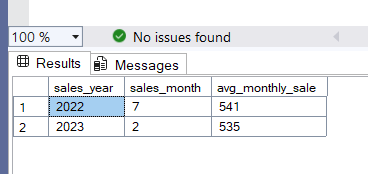

8. **Find the top 5 customers based on the highest total sales**
<pre> 
--Find the top 5 customers based on the highest total sales 
SELECT TOP 5 
       customer_id, 
       SUM(total_sale) AS total_sales
FROM retail_sales
GROUP BY customer_id
ORDER BY total_sales DESC;
</pre> 

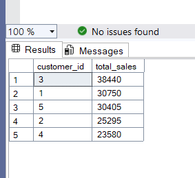

9. **Find the number of unique customers who purchased items from each category**
<pre>
--Find the number of unique customers who purchased items from each category 
SELECT category, 
       COUNT(DISTINCT customer_id) AS unique_customers
FROM retail_sales
GROUP BY category;
</pre> 

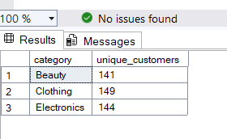

10. **Create each shift and number of orders**
<pre>
--Create each shift and number of orders 
SELECT 
    CASE 
        WHEN CAST(sale_time AS TIME) < '12:00:00' THEN 'Morning'
        WHEN CAST(sale_time AS TIME) BETWEEN '12:00:00' AND '17:00:00' THEN 'Afternoon'
        ELSE 'Evening'
    END AS shift,
    COUNT(*) AS total_orders
FROM retail_sales
GROUP BY 
    CASE 
        WHEN CAST(sale_time AS TIME) < '12:00:00' THEN 'Morning'
        WHEN CAST(sale_time AS TIME) BETWEEN '12:00:00' AND '17:00:00' THEN 'Afternoon'
        ELSE 'Evening'
    END;
</pre> 

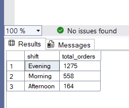

### References
- [Axia Africa SQL Project](https://drive.google.com/file/d/1lFQnJ7i-NhFIwiYWY_w2UBD4P3akzFz5/view?usp=drivesdk)
- [Axia Africa](https://student.axia.africa)
